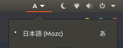
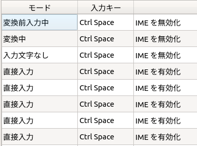

# Ubuntu 18.04

## US keyboard

https://blog.amedama.jp/entry/2017/03/10/210552

```bash
sudo dpkg-reconfigure keyboard-configuration
```

## ibus mozc の日本語・英語入力切り替え

入力ソースは Mozc のみにして，Mozc の中で日本語と英語を切り替えるのが一番手っ取り早い．

入力ソースを複数（e.g. 日本語に ibus-mozc と英語に US を割り当て）にして，Ubuntu の入力ソース切り替え機能を使ってもよいが，ibus-mozc はデフォルトで「ひらがな」入力ではなく「直接（英語）」入力なので非推奨（ログインするたびに Mozc の入力モードを「ひらがな」にする必要がある）．



Mozc の設定を次のようにする（「IME を無効化・有効化」の入力キーを任意のホットキーに設定する）


